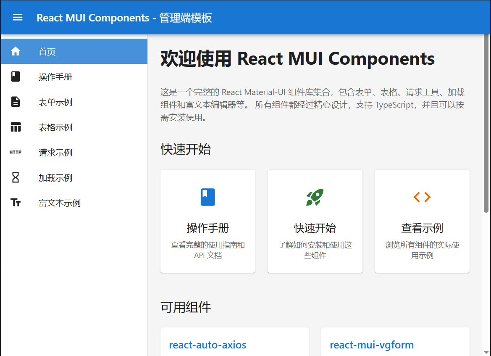
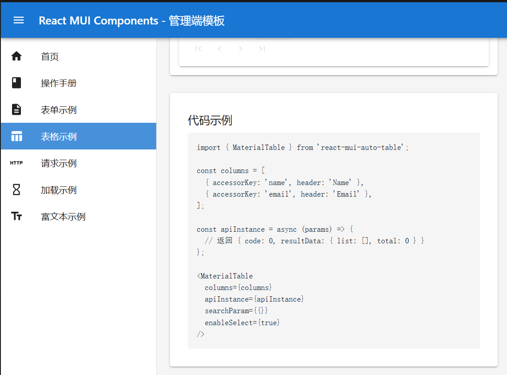
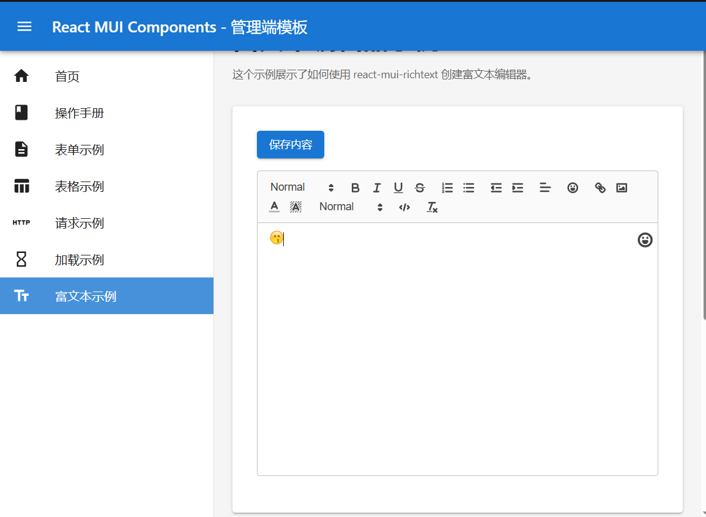
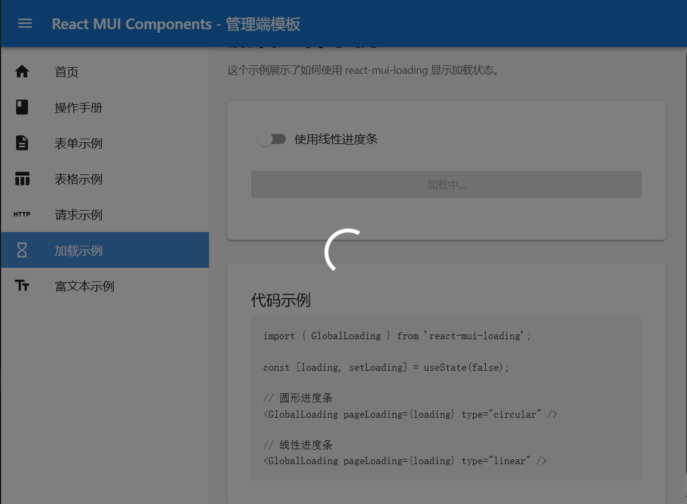
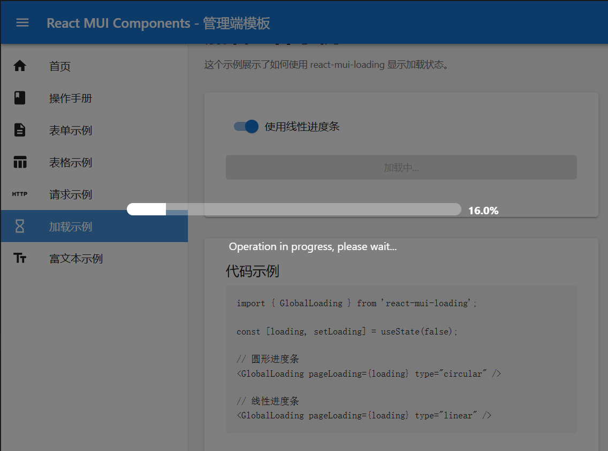
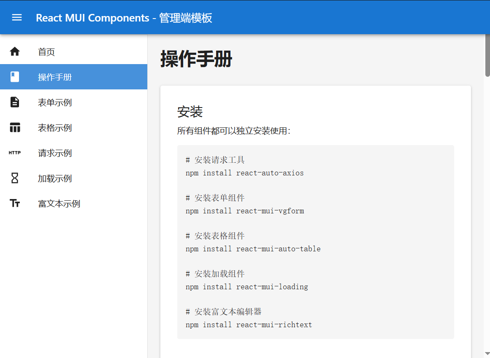

# React MUI Components Monorepo

这是一个 monorepo，包含多个独立的 React 组件包。

## 包列表

### 📦 [react-auto-axios](./packages/request)

独立的 HTTP 请求工具包，基于 axios 封装。

```bash
npm install react-auto-axios
```

### 📝 [react-mui-vgform](./packages/form)

独立的 React 表单组件库，基于 Material-UI 和 Formik。

```bash
npm install react-mui-vgform
```

### 📊 [react-mui-auto-table](./packages/table)

独立的表格组件库，基于 material-react-table。

```bash
npm install react-mui-auto-table
```

### 🔷 react-mui-types (即将推出)

TypeScript 类型定义包。

## 为什么是独立的包？

每个包都是完全独立的，可以：

- ✅ 单独安装和使用
- ✅ 独立版本管理
- ✅ 按需安装，减少 bundle 大小
- ✅ 灵活组合使用

## 使用示例

### 只使用请求工具

```bash
npm install react-auto-axios
```

```typescript
import { RequestClient } from "react-auto-axios";

const client = new RequestClient({
  baseURL: "https://api.example.com",
});
```

### 只使用表单组件

```bash
npm install react-mui-vgform
```

```typescript
import { FormItemList } from "react-mui-vgform";
```

### 组合使用

```bash
npm install react-auto-axios react-mui-vgform
```

```typescript
import { RequestClient } from "react-auto-axios";
import { FormItemList } from "react-mui-vgform";
```

## 开发

```bash
# 安装所有依赖
npm install

# 构建所有包
npm run build

# 构建特定包
cd packages/request && npm run build
cd packages/form && npm run build
```

## 示例项目

我们提供了一个完整的管理端模板和操作手册向导，展示如何使用所有组件：

```bash
# 进入示例项目
cd examples/admin-template

# 安装依赖
npm install

# 启动开发服务器
npm run dev
```

示例项目包含：

- 📋 完整的组件使用示例
- 📖 操作手册和 API 文档
- 🎨 基于 Material-UI 的管理端布局
- 💡 交互式示例，可以直接操作

访问 http://localhost:3000 查看示例。

## 图集

### 主页概览



### 组件示例

#### 表单组件


#### 表格组件



#### 富文本编辑器



#### 加载组件




### 操作手册



> **提示**: 如果图片还未上传，可以：
>
> 1. 在项目根目录创建 `docs/images/` 文件夹
> 2. 将截图保存为 PNG 格式并放入该文件夹
> 3. 提交到仓库后，图片会自动通过 GitHub 的 raw 链接显示

## 发布

## 关联 忽略提交历史

git pull origin main --allow-unrelated-histories

```bash
cd packages/request
npm publish

cd packages/form
npm publish
```

## 许可证

MIT
